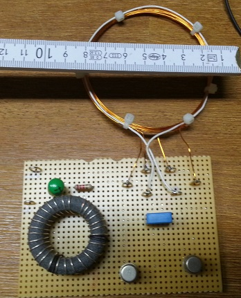
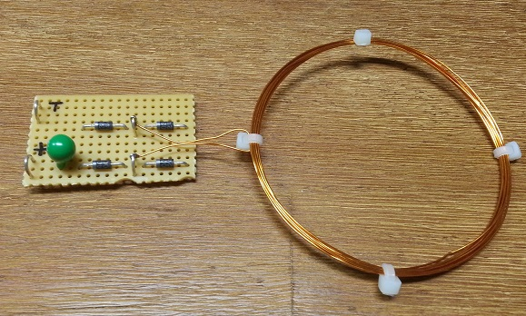
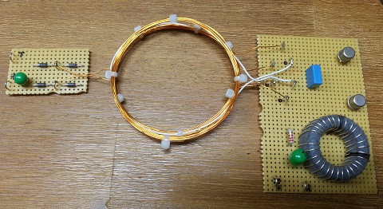
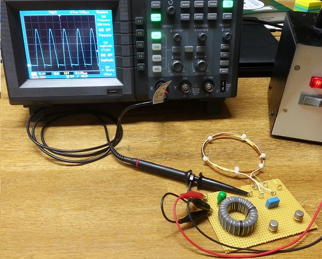
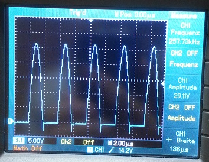

# royer-converter-2
My second self-made Royer oscillator.

Oscillator frequency: about 257 kHz.

Take a look also at my [first royer converter](https://github.com/aelfimow/royer-converter-1).

## Schematics
TODO

## Top of the board

## Rectifier board

## Rectifier board usage

## Measurement of the oscillator frequency

Result:

